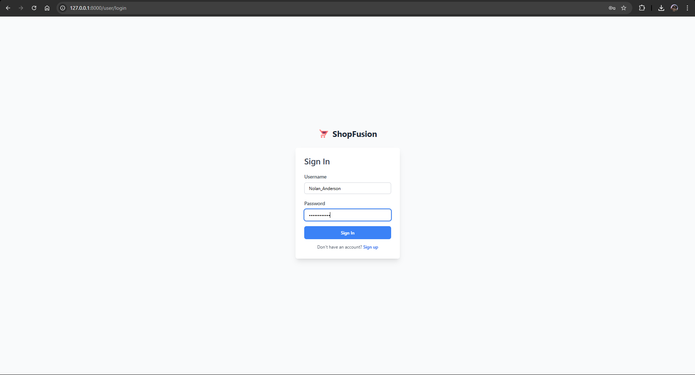

# ShopFusion - E-Commerce Web Application

ShopFusion is a modern e-commerce platform built with Django, providing a seamless shopping experience for users. The application allows customers to browse products, manage their carts, place orders, and manage their accounts. ShopFusion also features an intuitive dashboard for sellers to manage their products, track sales, and view statistics.

## Features

- **User Authentication**: User registration, login, and logout functionality.
- **Product Management**: Sellers can create, edit, and delete products.
- **Shopping Cart**: Add items to the cart and view cart details before checkout.
- **Checkout Process**: Users can complete their orders by providing personal details.
- **Sales Statistics**: Sellers can view statistics about their sales.
- **Responsive Design**: The platform is fully responsive and optimized for both desktop and mobile use.

## Technologies Used

- **Backend**: Django, Python
- **Frontend**: HTML, CSS (Bootstrap v5.3), JavaScript
- **Database**: SQLite (default) or PostgreSQL (for production)
- **Authentication**: Django's built-in authentication system
- **Web Framework**: Django


## Setup Instructions

### Prerequisites

- Python 3.x
- Django 4.x (or later)
- SQLite or PostgreSQL

### Installation

1. **Clone the Repository**

   ```bash
   git clone https://github.com/AdityaGarasangi/shopfusion-E-Commerce-Platform.git
   cd shopfusion-E-Commerce-Platform

2. **Install Dependencies**

   ```bash
   python -m venv venv
   source venv/bin/activate  # On Windows: venv\Scripts\activate
   pip install -r requirements.txt

3. **Set Up Database**

   ```bash
   python manage.py makemigrations
   python manage.py migrate

4. **Create Superuser (Optional)**

   ```bash
   python manage.py createsuperuser

5. **Run the Development Server**

   ```bash
   python manage.py runserver

6. **Access the Application**

   Open your browser and go to ```http://127.0.0.1:8000/user/register``` to view the website.


## Key Features and Pages

1. **Homepage**
   * Displays the list of products available in the store.
   * Provides an easy-to-navigate interface for users to explore items.
   


2. **Product Details**
   * Shows detailed information about a selected product.
   * Users can add the product to their cart and proceed to checkout.
     


3. **Shopping Cart and Checkout**
   * Users can review the products in their cart, modify quantities, and proceed to the checkout page.
   * The checkout form collects personal details like name, email, and address.
     
     


4. **User Authentication Pages**
   * **Login**: Allows users to log in to their accounts.
     
     
   * **Register**: New users can register for an account.
     
     
   * **Logout**: Logs out the user from the system.
     
     
   * **Profile**: Users can view and edit their profile information.
     


5. **Seller Dashboard**
   * Sellers can manage their products, view their sales statistics, and access their profile page.
   * Sellers can create, edit, and delete products on this page.
     


6. **Sales Stats**
   * Sellers can view detailed statistics about their sales, including revenue and order history.
     


7. **Product Management Pages**
   * **Create Products** Sellers can add new products to the platform.
     

   * **Edit/Remove Products** Sellers can modify/remove existing product details.
     
  

8. **Seller Page**
   * Allows sellers to manage their profile and product listings.
     


## Future Enhancements
   * **Payment Gateway Integration**: Integrate payment gateways like Stripe or PayPal for order payments.
   * **Product Reviews**: Allow customers to leave reviews and ratings on products.
   * **Order History**: Let users view their past orders and statuses.
